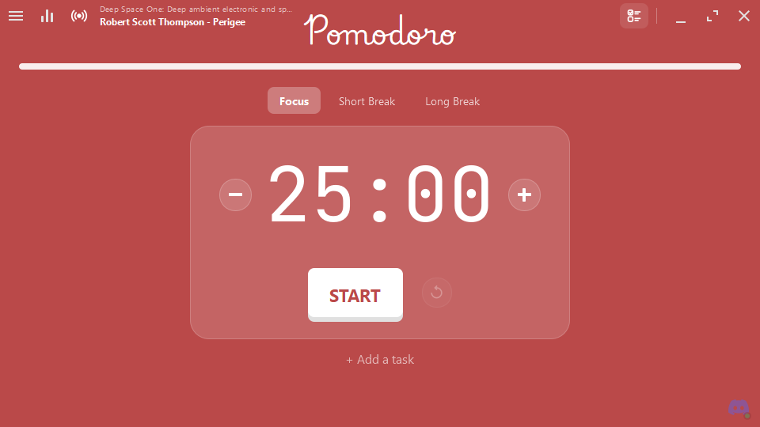

<div align="center">

# Pomodoro

**A focus timer with a task list, lo-fi radio, YouTube and Spotify, session statistics and native desktop integration.**

Built with C++17 and Qt 6 (Qt Quick / QML). One binary, no runtime dependencies beyond Qt.



</div>

## Features

- **Pomodoro timer** — focus, short break and long break sessions with configurable
  lengths, a configurable number of rounds before a long break, and optional automatic
  start of the next session. Drift-free: the clock is derived from a monotonic timer,
  not counted down tick by tick. Change a session's length right on the home screen:
  `−`/`+` beside the digits, the mouse wheel over them, or click them and type.
- **Task list** (optional) — note what you want to get done, pick the task you are
  working on, and every focus session you finish counts towards it. The current task
  shows under the timer. Turn it off in the settings if you do not want it.
- **Mini timer** — minimise the window and a small always-on-top timer takes its place;
  drag it anywhere, click it to come back.
- **Music while you work**, from the source you prefer:
  - **Radio** — a built-in list of lo-fi and ambient stations;
  - **YouTube** — any video, mix or live stream, played as audio through
    [yt-dlp](https://github.com/yt-dlp/yt-dlp) (the app offers to download it for you);
  - **Spotify** — connect your account and Pomodoro plays, pauses and shows what is on in
    your own Spotify app (Spotify allows this on Premium only);
  - **Link** — any Icecast, Shoutcast or HTTP audio stream.

  Streams reconnect on their own with exponential backoff if the connection drops, and
  the station and current track are shown next to the play button.
- **OS media controls** — the stream shows up as a real media source in the system:
  Windows **System Media Transport Controls**, **MPRIS** on Linux (GNOME, KDE,
  `playerctl`), and the **Now Playing** centre on macOS. Play, pause and the keyboard's
  media keys all work.
- **Session statistics** — focus minutes and pomodoros today, focus time over the last
  seven days, an all-time total, a daily streak and a seven-day chart. Stored locally.
- **Desktop notifications** — a notification and an alarm sound when a session ends.
- **System tray** — close hides the app to the tray with the timer still running; the
  tray menu and icon bring it back. A single instance is enforced.
- **Custom frameless window** — a compact, resizable landscape layout with a colour that
  follows the current mode.

## Download

Grab the latest build for your platform from the
[**Releases**](../../releases/latest) page. Everything installs into your own user
account — no administrator, no `sudo`.

| Platform | File | How |
| --- | --- | --- |
| Windows | `pomodoro-*-windows-x64-setup.exe` | Run it. Installs to `%LOCALAPPDATA%\Programs\Pomodoro`, adds a Start menu entry and an uninstaller. |
| Windows (portable) | `pomodoro-*-windows-x64.zip` | Unzip anywhere and run `pomodoro.exe`. |
| Linux | `pomodoro-*-x86_64.AppImage` | `chmod +x` it and run. It adds itself to your launcher on first start. |
| macOS | `pomodoro-*-macos.dmg` | Open it and drag Pomodoro to Applications. |

Once installed the app appears in the Start menu, your desktop's launcher or Spotlight,
with its icon, by typing its name. On Linux the AppImage writes a desktop entry to
`~/.local/share/applications` the first time it runs, so it is searchable without being
unpacked anywhere; delete that file to remove it.

**Updates** install themselves. The app checks for a new release when it starts and
every six hours after that; when one exists it downloads it in the background, checks it
against the SHA-256 checksum GitHub publishes for it, and installs it as soon as the timer
is stopped — a running or paused session is never interrupted — then reopens. Quitting
with an update waiting installs it on the way out. Every download works this way: the
Windows installer runs silently, the portable zip unpacks over its own folder, the
AppImage replaces itself, and on macOS the app swaps its own bundle for the new one.
Nothing opens a browser. Only builds from source and distribution packages, which the
app did not install, leave updating to you.

### About the security warnings

The builds are not code-signed, so the first launch shows a warning: on Windows
"Windows protected your PC … Unknown publisher" (click **More info → Run anyway**), and on
macOS an unidentified-developer notice (right-click the app → **Open**). This is not a
sign that anything is wrong with the download — it is what every unsigned application
looks like. Removing it requires a paid code-signing certificate, which this project does
not have; the CI is set up to sign automatically if one is ever added. Every release is
built in public by GitHub Actions from the tagged commit, so you can read exactly what
went into it.

## Keyboard shortcuts

| Key | Action |
| --- | --- |
| `Space` | Start / pause the timer |
| `R` | Reset the current session |
| `S` | Skip to the next session |
| `Ctrl` + `,` | Open settings |
| `Ctrl` + `T` | Open the task list |
| `Esc` | Close the open drawer |
| `Ctrl` + `Q` | Quit |

## Building and testing

### With Docker — nothing to install but Docker

The image carries the compiler, Qt and every library the app links against, so there is
nothing to install and nothing to go missing. It compiles whatever is in your working
copy, not a copy baked into the image, so this is the quickest way to check a change
before opening a pull request:

```bash
make test
```

That builds the image on first use, compiles the app and runs the test suite. Other
targets — `make` on its own lists them all:

| Command | Does |
| --- | --- |
| `make test` | Compile and run the tests. What a pull request should pass. |
| `make smoke` | Start the app headless and check its QML and icons actually load. |
| `make build` | Compile only. |
| `make shell` | A prompt inside the toolchain. |
| `make run` | Open the actual window (see the note below). |
| `make clean` | Throw away the container's build tree. |
| `make rebuild` | Rebuild the image ignoring the cache, then test. |

The container builds into `build-docker/` — kept separate from `build/` so it can never
collide with a native build on the same checkout.

`make run` opens a real window and therefore needs an X server on the host. On Linux that
is already running. On macOS it needs XQuartz and on Windows an X server such as VcXsrv,
both with connections from the container allowed. **The tests need none of this**, which
is why testing is the path that works everywhere.

The container has no sound card, so running the GUI inside it prints a few warnings that
are expected and harmless:

```
PulseAudioService: pa_context_connect() failed
qt.multimedia.soundeffect: Failed to update audio output. No audio devices available.
pomodoro: could not load sound ...
Failed to open VDPAU backend ...
```

The timer, the window and the stream all work; only the alarm and click cues are silent.
Getting audio out of a container means handing it the host's sound socket, which is
specific to each machine and deliberately not wired up here. Run the app natively to hear
it.

Everything is plain `docker compose` underneath if you would rather not use `make`:

```bash
docker compose run --rm test
```

### Natively

Requirements: CMake ≥ 3.21, Ninja, and Qt ≥ 6.5 with the Core, Gui, Qml, Quick,
QuickControls2, Multimedia, Network, Svg, DBus and Widgets modules.

```bash
make native-test      # configure, compile and run the tests
make native-run       # build and launch
```

Or by hand, which is all the above does:

```bash
cmake -S . -B build -G Ninja -DCMAKE_BUILD_TYPE=Release -DBUILD_TESTING=ON
cmake --build build
ctest --test-dir build --output-on-failure
./build/pomodoro          # pomodoro.exe on Windows
```

### Releasing

Continuous integration builds and tests every push on Linux, Windows and macOS. Pushing
a version tag builds the packages and publishes them on a GitHub Release:

```bash
git tag v1.2.3
git push origin v1.2.3
```

The tag is the version: CMake reads it (or `-DPOMODORO_VERSION=`), so there is no version
number to edit in the source before tagging.

## Tech stack

C++17 · Qt 6 (Qt Quick / QML, Multimedia, Network, DBus, Widgets) · CMake · GitHub Actions.

The UI is written in QML; all logic lives in C++ types exposed to QML. Platform
integration is handled natively per OS — SMTC via the WinRT ABI on Windows, MPRIS over
D-Bus on Linux, and the Media Player framework on macOS.
